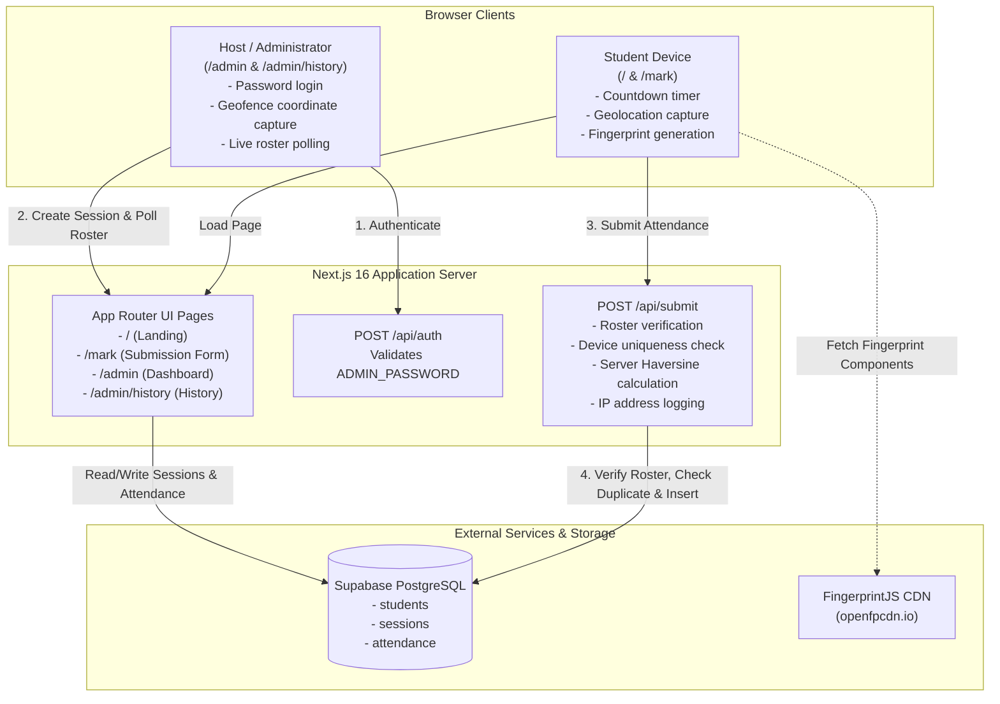

# Smart Attendance System

A lightweight, proxy-resistant, session-based attendance management system built with Next.js 16 (App Router), Supabase (PostgreSQL), browser device fingerprinting, and GPS geofencing.

The application enables educators and administrators to open time-boxed attendance sessions from an admin panel. Students mark their attendance directly from their mobile or desktop web browsers without creating personal accounts, while server-side validations enforce student record matching, device uniqueness, and optional location proximity.

---

## Table of Contents

- [Project Overview](#project-overview)
- [Key Features](#key-features)
- [Technology Stack](#technology-stack)
- [System Architecture](#system-architecture)
- [Project Structure](#project-structure)
- [Setup & Prerequisites](#setup--prerequisites)
- [Environment Variables](#environment-variables)
- [Database Setup & Schema](#database-setup--schema)
- [Local Development](#local-development)
- [Available Scripts](#available-scripts)
- [Docker Configuration](#docker-configuration)
  - [Build Docker Image](#build-docker-image)
  - [Run with Docker](#run-with-docker)
  - [Run with Docker Compose](#run-with-docker-compose)
- [API Documentation](#api-documentation)
- [Production Build](#production-build)
- [Deployment](#deployment)
- [Troubleshooting](#troubleshooting)

---

## Project Overview

### Problem Solved
Traditional classroom attendance methods rely on verbal roll calls or circulating sign-in sheets. These approaches waste instructional time, produce paper waste, require manual transcription, and are susceptible to proxy marking ("buddy punching").

### How It Works
1. **Session Initialization**: An instructor or class representative accesses the protected `/admin` panel using an administrator password. The host selects a session duration (3, 5, 10, or 15 minutes), optionally enables GPS geofencing with a radius (50m, 100m, 200m, or 500m), and starts the session. The host's browser geolocation coordinates are captured as the geofence center point.
2. **Student Access**: Students navigate to the home page (`/`) on their mobile device or laptop. The portal displays a real-time countdown timer reflecting the active session. When active, students proceed to `/mark`.
3. **Identity & Device Verification**: Students provide their registered full name and university roll number. In the background, FingerprintJS generates a hardware/browser visitor fingerprint, and the HTML5 Geolocation API retrieves student coordinates if geofencing is enabled.
4. **Server-Side Validation**: The attendance submission is sent to `/api/submit`, where the server executes four validation checks:
   - **Student Identity**: Validates the student name and roll number case-insensitively against the `students` roster table.
   - **Device Lock (Anti-Proxy)**: Confirms that the device fingerprint has not already submitted attendance for the current session.
   - **Geofence Proximity**: Recalculates the student's distance from the host coordinates using the Haversine formula on the server.
   - **Audit Record Creation**: Persists the attendance entry with the student reference, session reference, device ID, client IP address, and timestamp.
5. **Real-Time Monitoring & Reporting**: The `/admin` dashboard continuously polls new entries, displaying live attendee counts, attendance percentages, and a sorted roster. A single-click "Copy List" action formats the roster into plain text ready for distribution via WhatsApp, SMS, or email.
6. **Session History**: Past sessions can be inspected, copied, or deleted at `/admin/history`.

---

## Key Features

- **Time-Boxed Sessions**: Configurable countdown durations of 3, 5, 10, or 15 minutes. Automatically expires and rejects late submissions.
- **Zero-Registration Student Flow**: Students enter their name and roll number without creating credentials or installing native applications.
- **Hardware/Browser Fingerprinting**: Integrates `@fingerprintjs/fingerprintjs` to generate unique visitor identifiers, preventing a single device from submitting attendance for multiple students during the same session.
- **Server-Side Geofencing**: Optional geographic validation calculating distance with the Haversine formula. Distance verification is performed on the server rather than trusting client calculations.
- **Configurable Geofence Radius**: Selectable proximity radii of 50m, 100m, 200m, or 500m around the host location.
- **Real-Time Host Dashboard**: Automatic live polling every 4 seconds displaying total present, attendance percentage, and roll-sorted attendees.
- **Single-Click Plaintext Export**: Generates pre-formatted plaintext reports with subject name, date, attendance summary, and roll numbers for messaging platforms.
- **Session History Management**: Review recent sessions, inspect historical attendance records, and delete outdated records.
- **Password-Gated Admin Area**: Simple password protection on admin routes and verification endpoints.
- **Strict Content Security Policy (CSP)**: Configured HTTP security headers restricting external script, font, and network origins to verified endpoints.

---

## Technology Stack

| Layer | Technology | Version | Purpose |
|---|---|---|---|
| **Framework** | [Next.js](https://nextjs.org/) (App Router, Turbopack) | `16.2.6` | Fullstack React framework & API routes |
| **Library** | [React](https://react.dev/) / React DOM | `19.2.4` | Declarative user interface |
| **Compiler** | `babel-plugin-react-compiler` | `1.0.0` | React compiler optimization |
| **Styling** | [Tailwind CSS](https://tailwindcss.com/) + `@tailwindcss/postcss` | `^4.0.0` | Utility-first styling framework |
| **Database** | [Supabase](https://supabase.com/) (`@supabase/supabase-js`) | `^2.105.4` | Hosted PostgreSQL database client |
| **Device Identification**| [FingerprintJS](https://github.com/fingerprintjs/fingerprintjs) | `^5.2.0` | Client-side browser visitor identification |
| **Linter** | [ESLint](https://eslint.org/) + `eslint-config-next` | `^9.0.0` / `16.2.6` | Code analysis and style enforcement |
| **Containerization** | [Docker](https://www.docker.com/) & Docker Compose | Multi-stage | Isolated container build and deployment |

---

## System Architecture



---

## Project Structure

```
smart-attendance/
├── app/
│   ├── admin/
│   │   ├── history/
│   │   │   └── page.js           # Session history view, attendance review, deletion
│   │   └── page.js               # Admin dashboard, session controller, live roster
│   ├── api/
│   │   ├── auth/
│   │   │   └── route.js          # POST /api/auth endpoint for admin password check
│   │   └── submit/
│   │       └── route.js          # POST /api/submit endpoint for attendance validation & insertion
│   ├── mark/
│   │   └── page.js               # Student attendance submission form & location capture
│   ├── favicon.ico               # Application favicon
│   ├── globals.css               # Tailwind CSS imports and root style variables
│   ├── layout.js                 # Root layout with Geist font definitions
│   └── page.js                   # Public landing page with active session countdown
├── lib/
│   ├── geofence.js               # Haversine distance calculator and client geolocation helper
│   └── supabase.js               # Supabase JavaScript client initialization
├── public/                       # Static SVG assets
├── .dockerignore                 # Excluded paths for Docker context
├── .env.example                  # Environment variable reference template
├── .gitignore                    # Git ignored files and directories
├── docker-compose.yml            # Docker Compose multi-stage service definition
├── Dockerfile                    # Multi-stage production container build
├── eslint.config.mjs             # ESLint configuration with Next.js vitals
├── jsconfig.json                 # Path aliases configuration (@/* mapping)
├── next.config.mjs               # Next.js standalone output & Content-Security-Policy headers
├── package.json                  # Dependencies and execution scripts
├── package-lock.json             # Locked dependency tree
└── postcss.config.mjs            # PostCSS configuration for Tailwind v4
```

---

## Setup & Prerequisites

- **Node.js**: `v18.17.0` or higher (Node `20.x` or `22.x` recommended; developed and tested on Node `24.x`).
- **Package Manager**: `npm` (v9 or higher).
- **Supabase Account**: An active Supabase project with PostgreSQL enabled.
- **Docker** *(Optional)*: Docker Engine and Docker Compose if running containerized.

---

## Environment Variables

The project requires the following environment variables. Create a `.env.local` file in the root directory:

```bash
cp .env.example .env.local
```

### Configuration Keys

| Variable | Required | Scope | Purpose |
|---|---|---|---|
| `NEXT_PUBLIC_SUPABASE_URL` | Yes | Client & Server | The URL of your Supabase project (e.g., `https://xyzproject.supabase.co`). |
| `NEXT_PUBLIC_SUPABASE_ANON_KEY` | Yes | Client & Server | The public anonymous API key for querying Supabase. |
| `ADMIN_PASSWORD` | Yes | Server Only | Secret password required to access `/admin` and `/admin/history`. |
| `NEXT_PUBLIC_GEOFENCING_ENABLED` | Optional | Client Only | Default fallback toggle for client geofencing checks (`true` or `false`). |

> [!CAUTION]
> Never commit `.env.local` or expose `ADMIN_PASSWORD` or Supabase service-role keys in public repositories or client-side bundles.

---

## Database Setup & Schema

Execute the following SQL queries in the **Supabase SQL Editor** to initialize the required tables and relationships:

```sql
-- 1. Students Roster Table
CREATE TABLE IF NOT EXISTS students (
    id UUID PRIMARY KEY DEFAULT gen_random_uuid(),
    name TEXT NOT NULL,
    roll_number TEXT NOT NULL UNIQUE
);

-- 2. Attendance Sessions Table
CREATE TABLE IF NOT EXISTS sessions (
    id UUID PRIMARY KEY DEFAULT gen_random_uuid(),
    created_at TIMESTAMPTZ DEFAULT now() NOT NULL,
    expires_at TIMESTAMPTZ NOT NULL,
    duration_minutes INTEGER NOT NULL,
    is_active BOOLEAN DEFAULT true NOT NULL,
    subject TEXT,
    host_lat DOUBLE PRECISION,
    host_lng DOUBLE PRECISION,
    geo_radius INTEGER DEFAULT 100,
    geo_enabled BOOLEAN DEFAULT false NOT NULL
);

-- 3. Attendance Records Table
CREATE TABLE IF NOT EXISTS attendance (
    id UUID PRIMARY KEY DEFAULT gen_random_uuid(),
    session_id UUID NOT NULL REFERENCES sessions(id) ON DELETE CASCADE,
    student_id UUID NOT NULL REFERENCES students(id) ON DELETE CASCADE,
    device_id TEXT NOT NULL,
    ip_address TEXT,
    submitted_at TIMESTAMPTZ DEFAULT now() NOT NULL
);

-- Indexes for performance
CREATE INDEX IF NOT EXISTS idx_attendance_session ON attendance(session_id);
CREATE INDEX IF NOT EXISTS idx_attendance_device ON attendance(session_id, device_id);
CREATE INDEX IF NOT EXISTS idx_sessions_active ON sessions(is_active, expires_at);
```

### Pre-populating Students Roster
Before hosting attendance sessions, insert your class roster into the `students` table:

```sql
INSERT INTO students (name, roll_number) VALUES
    ('John Doe', '01'),
    ('Jane Smith', '02'),
    ('Alex Johnson', '03');
```

---

## Local Development

1. **Clone the repository**:
   ```bash
   git clone https://github.com/manashprasad94-create/smart-Attendance.git
   cd smart-attendance
   ```

2. **Install dependencies**:
   ```bash
   npm install
   ```

3. **Configure environment variables**:
   Create a `.env.local` file using the keys described in the [Environment Variables](#environment-variables) section.

4. **Start the development server**:
   ```bash
   npm run dev
   ```

5. **Access the application**:
   - **Student Portal**: [http://localhost:3000](http://localhost:3000)
   - **Student Attendance Form**: [http://localhost:3000/mark](http://localhost:3000/mark)
   - **Host Admin Panel**: [http://localhost:3000/admin](http://localhost:3000/admin)
   - **Session History**: [http://localhost:3000/admin/history](http://localhost:3000/admin/history)

---

## Available Scripts

The following scripts are defined in `package.json`:

| Command | Description |
|---|---|
| `npm run dev` | Runs the development server on `http://localhost:3000` with Turbopack |
| `npm run build` | Compiles the production build with Next.js standalone output |
| `npm run start` | Runs the compiled production server on port 3000 |
| `npm run lint` | Runs ESLint 9 using the Next.js Core Web Vitals ruleset |

---

## Docker Configuration

The application includes a production-grade, multi-stage `Dockerfile` leveraging Alpine Linux and Next.js standalone mode to produce a lightweight, secure container image (~150MB).

### Build Docker Image

Build the Docker image with your public build arguments:

```bash
docker build \
  --build-arg NEXT_PUBLIC_SUPABASE_URL="https://your-project-id.supabase.co" \
  --build-arg NEXT_PUBLIC_SUPABASE_ANON_KEY="your-supabase-anon-key" \
  --build-arg NEXT_PUBLIC_GEOFENCING_ENABLED="true" \
  -t smart-attendance .
```

### Run with Docker

Run the container using your local `.env.local` file for runtime secrets:

```bash
docker run -d \
  --name smart-attendance \
  --env-file .env.local \
  -p 3000:3000 \
  smart-attendance
```

Access the application at [http://localhost:3000](http://localhost:3000).

To view logs or stop the container:
```bash
docker logs -f smart-attendance
docker stop smart-attendance
docker rm smart-attendance
```

### Run with Docker Compose

A `docker-compose.yml` file is provided to streamline building and execution. Environment variables from `.env.local` are automatically loaded into both build arguments and container environment variables.

1. **Start the application**:
   ```bash
   docker compose up --build -d
   ```

2. **Check running status and logs**:
   ```bash
   docker compose ps
   docker compose logs -f
   ```

3. **Stop the application**:
   ```bash
   docker compose down
   ```

### Docker Verification & Test Results

The Docker configuration has been fully tested and verified against the live Docker Desktop engine:

| Check | Status | Verification Details |
|---|---|---|
| **Multi-Stage Build** | **PASS** | Successfully built with `node:20-alpine`, `npm ci`, and Next.js 16 Turbopack standalone output. |
| **Container Startup** | **PASS** | Container `smart-attendance` started cleanly via `docker compose up --build -d`. |
| **Process Security** | **PASS** | Runs Next.js standalone server as a non-root system user (`nextjs:nodejs`, UID 1001). |
| **HTTP Accessibility** | **PASS** | Responding on `http://localhost:3000` with HTTP 200 OK. |
| **Route `/`** | **PASS** | Student landing page rendered successfully (HTTP 200). |
| **Route `/admin`** | **PASS** | Host admin dashboard & password gate rendered successfully (HTTP 200). |
| **Route `/mark`** | **PASS** | Student attendance form rendered successfully (HTTP 200). |
| **Route `/admin/history`** | **PASS** | Session history page rendered successfully (HTTP 200). |
| **Endpoint `/api/auth`** | **PASS** | Password validation endpoint confirmed functional (returns 401 on invalid credential). |
| **Environment Handling** | **PASS** | `NEXT_PUBLIC_*` and `ADMIN_PASSWORD` securely loaded without baking secrets into images. |
| **Context Isolation** | **PASS** | Host `.git`, `.env*`, `node_modules`, and `.next` verified absent from production image. Content size ~60MB. |

---

## API Documentation

### 1. Admin Authentication
Validates the host password before granting access to `/admin` or `/admin/history`.

- **Route**: `POST /api/auth`
- **Authentication**: None (Supplies password in body)
- **Request Body**:
  ```json
  {
    "password": "your-admin-password"
  }
  ```
- **Response**:
  - `200 OK`:
    ```json
    { "success": true }
    ```
  - `401 Unauthorized`:
    ```json
    { "success": false }
    ```

---

### 2. Submit Attendance
Validates student identity, checks for duplicate devices, recalculates geofence distance, and records the attendance entry.

- **Route**: `POST /api/submit`
- **Authentication**: None (Publicly callable by students during an active session)
- **Request Body**:
  ```json
  {
    "name": "John Doe",
    "roll": "01",
    "sessionId": "b3e0c034-7a3d-4c3e-9762-09c0bfbbbb14",
    "studentLat": 28.6139,
    "studentLng": 77.2090,
    "deviceId": "c8a4103fa7d82b0e"
  }
  ```
- **Response**:
  - `200 OK` (Attendance Recorded):
    ```json
    {
      "success": true,
      "name": "John Doe"
    }
    ```
  - `400 Bad Request` (Roster Mismatch):
    ```json
    {
      "error": "Name and roll number do not match our records."
    }
    ```
  - `400 Bad Request` (Duplicate Device Detected):
    ```json
    {
      "error": "Attendance has already been submitted from this device for this session."
    }
    ```
  - `400 Bad Request` (Geofence Exceeded):
    ```json
    {
      "error": "You are 350m away. Must be within 100m."
    }
    ```
  - `500 Internal Server Error`:
    ```json
    {
      "error": "Server error. Please try again."
    }
    ```

---

## Production Build

To test or deploy the production build on a bare-metal server or VM without Docker:

```bash
# 1. Generate optimized standalone production build
npm run build

# 2. Run the production server
npm run start
```

The production server starts on port `3000` by default.

---

## Deployment

### Vercel Deployment

The application is natively optimized for [Vercel](https://vercel.com/):

1. Push your repository to GitHub, GitLab, or Bitbucket.
2. Import the project into the [Vercel Dashboard](https://vercel.com/new).
3. Under **Project Settings > Environment Variables**, add:
   - `NEXT_PUBLIC_SUPABASE_URL`
   - `NEXT_PUBLIC_SUPABASE_ANON_KEY`
   - `ADMIN_PASSWORD`
   - `NEXT_PUBLIC_GEOFENCING_ENABLED` (set to `true` or `false`)
4. Click **Deploy**.

### Self-Hosted / Container Deployment
Deploy the containerized image to platforms such as AWS ECS, Google Cloud Run, Railway, Render, or any VPS running Docker Compose. Ensure port `3000` is mapped and the required environment variables are configured in the container runtime environment.

---

## Troubleshooting

### 1. "Name and roll number do not match our records"
- Ensure that the student's name and roll number have been inserted into the `students` table in Supabase.
- Verification is case-insensitive, but trailing or extra whitespace must match standard spacing.

### 2. "Attendance has already been submitted from this device for this session"
- FingerprintJS identifies the browser/device. If a student tries to mark attendance for another classmate using the same browser, the submission is rejected.
- To test with multiple submissions on a single machine during testing, use separate browser profiles or private/incognito windows with distinct fingerprints.

### 3. Geolocation Errors ("Location permission denied" / "Location is required")
- The browser requires HTTPS to access the HTML5 Geolocation API (except when using `localhost`). Ensure the production deployment is served over HTTPS.
- Students must allow location permissions when prompted by their mobile or desktop browser.

### 4. Admin Login Rejections
- Ensure `ADMIN_PASSWORD` is accurately defined in `.env.local` without extraneous quotes or trailing spaces.
- Restart the development server (`npm run dev`) after modifying `.env.local`.

### 5. Content Security Policy (CSP) Violations
- If adding external resources, check `next.config.mjs`. The CSP policy restricts external connections to Supabase (`https://*.supabase.co`, `wss://*.supabase.co`) and FingerprintJS (`https://*.openfpcdn.io`, `https://api.fpjs.io`).

### 6. Port 3000 Conflicts
- If port `3000` is occupied, specify an alternative port:
  ```bash
  # Local
  PORT=3001 npm run dev

  # Docker
  docker run -p 3001:3000 --env-file .env.local smart-attendance
  ```

---

## License & Credits

Built for IT1 (2024–2028). Created by **Manash**.
